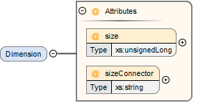

== Common Content (SSC) [[SSC]]

Common Structures and Attributes that are used across all XML Schemas are defined in the SystemStructureCommon.xsd Schema, which is imported by all other XML Schemas.
All Types and AttributeGroups live in the `http://ssp-standard.org/SSP1/SystemStructureCommon` namespace, nicknamed `ssc`.

=== Common Attributes

All XML elements that correspond to an entity of the system model will have the following set of common XML attributes, as defined in the ssc:ABaseElement attribute group:

image:images/image1.png[image,width=261,height=101]

[width="100%",cols="18%,82%",options="header",]
|===
|Attribute |Description
|id |This optional attribute gives the model entity a file-wide unique id which can be referenced from other entities or via URI fragment identifier.
|description |This optional attribute gives a human readable longer description of the model entity, which can be shown to the user where appropriate.
|===

=== Common XML Child Elements

All XML elements that correspond to an entity of the system model will have the following set of common child elements:

image:images/image2.png[image,width=324,height=35]

[width="100%",cols="18%,82%",options="header",]
|===
|Element |Description
|Annotations |This optional element can be used to give additional information for any model entity.
When it is present, it *MUST* contain 1 or more Annotation elements as specified below.
|===

Each annotation is encapsulated in an Annotation element, with a required type attribute specifying the type of the annotation, and arbitrary XML content from arbitrary namespaces.

image:images/image3.png[image,width=310,height=137]

In order to ensure uniqueness the annotation type *SHOULD* be provided in reverse domain name notation [ _cf.
Java package names or Apple UTIs_ ] of a domain that is controlled by the entity defining the semantics and content of the annotation.
For vendor-specific annotations this *SHOULD* be a domain controlled by the tool vendor.
For MAP-SSP-defined annotations, this *MUST* be a domain under the org.modelica or org.ssp-standard prefixes.
Annotations that are not defined by MAP SSP *MUST NOT* use these two prefixes,

This mechanism can be used both for tool-specific annotations, as well as for layered standards (see <<Versioning and Layered Standards>>) and other agreed-upon extensions, and thus provides a generic extension mechanism.

=== Top-Level Attributes

Top-level attributes are optional meta-data attributes common to all top-level container elements of all defined file formats.

image:images/image4.png[image,width=348,height=317]

[width="100%",cols="28%,72%",options="header",]
|===
|Attribute |Description
|author |Optional attribute giving the name and/or organization of the author of the contents of this file.
|fileversion |Optional attribute giving the version of the contents of this file.
|copyright |Optional attribute giving information about copyrights of the contents of this file.
|license |Optional attribute giving information about licensing of the contents of this file.
|generationTool |Optional attribute giving information about the tool used to generate this file.
|generationDateAndTime |Optional attribute giving the date and time this file was generated.
|===

=== Top-Level XML Child Elements

Top-level elements of a defined file format may have the following set of common child elements.

By design, the enumeration and unit definitions for each file are included in that file directly (i.e. enumeration and unit definitions are file scoped).
This is intended to ensure the separate portability of individual files, with each file containing a self-consistent set of information.
When processing information from multiple files, either from the same or separate system structures, it is up to the importing implementation to deal with any inconsistencies between files found.

==== Enumerations

image:images/image5.png[image,width=397,height=47]

This optional element *MUST* contain definitions for all enumerations referenced in a file.

{empty}[ _As a file-based interchange standard, the natural scope for units and enumerations is the file scope, so that files can be parsed and processed separately, without the need for cross-file references or scoped references with the possibilities of shadowing and ambiguities._
_Upon import tools are free to merge unit information across files or separate them between hierarchy layers as they see fit._ ]

image:images/image6.png[image,width=441,height=273]

Each enumeration is defined through an Enumeration XML element:

[width="100%",cols="28%,72%",options="header",]
|===
|Attribute |Description
|name |This required attribute provides a name, which *MUST* be unique within the set of enumerations in a given file.
|===

The following XML child elements are specified for the Enumeration element:

[width="100%",cols="18%,82%",options="header",]
|===
|Element |Description
|Item |One or more elements specifying the items of the enumeration.
|===

===== Item

image:images/image7.png[image,width=225,height=149]

For each item in the enumeration there is one Item XML element with the following attributes:

[width="100%",cols="28%,72%",options="header",]
|===
|Attribute |Description
|name |This required attribute provides a name for the enumeration item.
|value |This required attribute provides a value for the enumeration item.
|===

==== Units

image:images/image8.png[image,width=315,height=47]

This optional element *MUST* contain definitions for all units referenced in a file.

{empty}[ _As a file-based interchange standard, the natural scope for units and enumerations is the file scope, so that files can be parsed and processed separately, without the need for cross-file references or scoped references with the possibilities of shadowing and ambiguities._
_Upon import tools are free to merge unit information across files or separate them between hierarchy layers as they see fit._ ]

image:images/image9.png[image,width=380,height=273]

Each unit is defined through a Unit XML element:

[width="100%",cols="28%,72%",options="header",]
|===
|Attribute |Description
|name |This required attribute provides a name, which *MUST* be unique within the set of units in a given file.
|===

The following XML child elements are specified for the Unit element:

[width="100%",cols="18%,82%",options="header",]
|===
|Element |Description
|BaseUnit |Required element defining the base unit of the given unit in SI units, see below.
|===

===== BaseUnit

This element defines the base unit of the given unit in SI units.
This is completely aligned with the specification of base units in section 2.2.2 of the FMI 2.0 standard [FMI20].

image:images/image10.png[image,width=263,height=771]

[width="100%",cols="28%,72%",options="header",]
|===
|Attribute |Description
|kg |Optional attribute specifying the exponent of SI base unit kg, defaults to 0.
|m |Optional attribute specifying the exponent of SI base unit m, defaults to 0.
|s |Optional attribute specifying the exponent of SI base unit s, defaults to 0.
|A |Optional attribute specifying the exponent of SI base unit A, defaults to 0.
|K |Optional attribute specifying the exponent of SI base unit K, defaults to 0.
|mol |Optional attribute specifying the exponent of SI base unit mol, defaults to 0.
|cd |Optional attribute specifying the exponent of SI base unit cd, defaults to 0.
|rad |Optional attribute specifying the exponent of SI base unit rad, defaults to 0.
|factor |Optional attribute specifying an optional factor, defaults to 1.
|offset |Optional attribute specifying an optional offset, defaults to 0.
|===

=== XML Element Groups

These XML element choices and sequences are common to multiple file formats.
They are used inside elements to select one of multiple child elements, or provide common sequence content.

[#ssc_types]
==== Type Choice

image:images/image11.png[image,width=312,height=203]

The following XML child elements denote the data type of a connector or dictionary entry.
[ _Note that in the case of connectors the use of a type element itself is optional, in the case of dictionary entries it is required_ ].

[width="100%",cols="33%,67%",options="header",]
|===
|Element |Description
|Real / Float64 / Float32 / +
Integer / Int8 / UInt8 / Int16 / UInt16 / +
Int32 / UInt32 / Int64 / UInt64 / +
Boolean / String / Enumeration / Binary |Exactly one of these elements *MUST* be present to specify the type of the element. See below for details.
|===

===== Real

image:images/image12.png[image,width=226,height=95]

This type specifies that the connector in question represents an IEEE754 double precision floating point number.

[width="100%",cols="28%,72%",options="header",]
|===
|Attribute |Description
|unit |This optional attribute gives the name of a unit. The name *MUST* match the name of a Unit entry in the Units XML element of the top-level element of the file. +
If the attribute is not supplied, the unit is determined through default mechanisms:
For FMU components, the unit of the underlying variable would be used, or no unit, if no unit is specified.
For systems, the units of connected underlying connectors could be used if unambiguous. +
If a unit (or its absence) cannot be deduced unambinguously, the user should be informed of this error. +
Notwithstanding these mechanisms, unitless variables of type Real are supported.
|===

===== Float64

image:images/image12.png[image,width=226,height=95]

This type specifies that the connector in question represents an IEEE754 double precision floating point number.

[width="100%",cols="28%,72%",options="header",]
|===
|Attribute |Description
|unit |This optional attribute gives the name of a unit. The name *MUST* match the name of a Unit entry in the Units XML element of the top-level element of the file. +
If the attribute is not supplied, the unit is determined through default mechanisms:
For FMU components, the unit of the underlying variable would be used, or no unit, if no unit is specified.
For systems, the units of connected underlying connectors could be used if unambiguous. +
If a unit (or its absence) cannot be deduced unambinguously, the user should be informed of this error. +
Notwithstanding these mechanisms, unitless variables of type Float64 are supported.
|===

===== Float32

image:images/image12.png[image,width=226,height=95]

This type specifies that the connector in question represents an IEEE754 single precision floating point number.

[width="100%",cols="28%,72%",options="header",]
|===
|Attribute |Description
|unit |This optional attribute gives the name of a unit. The name *MUST* match the name of a Unit entry in the Units XML element of the top-level element of the file. +
If the attribute is not supplied, the unit is determined through default mechanisms:
For FMU components, the unit of the underlying variable would be used, or no unit, if no unit is specified.
For systems, the units of connected underlying connectors could be used if unambiguous. +
If a unit (or its absence) cannot be deduced unambinguously, the user should be informed of this error. +
Notwithstanding these mechanisms, unitless variables of type Float32 are supported.
|===

===== Integer

image:images/image13.png[image,width=56,height=28]

This type specifies that the connector in question represents a 32-bit signed integer number.

===== Int8

image:images/image13.png[image,width=56,height=28]

This type specifies that the connector in question represents a 8-bit signed integer number.

===== UInt8

image:images/image13.png[image,width=56,height=28]

This type specifies that the connector in question represents a 8-bit unsigned integer number.

===== Int16

image:images/image13.png[image,width=56,height=28]

This type specifies that the connector in question represents a 16-bit signed integer number.

===== UInt16

image:images/image13.png[image,width=56,height=28]

This type specifies that the connector in question represents a 16-bit unsigned integer number.

===== Int32

image:images/image13.png[image,width=56,height=28]

This type specifies that the connector in question represents a 32-bit signed integer number.

===== UInt32

image:images/image13.png[image,width=56,height=28]

This type specifies that the connector in question represents a 32-bit unsigned integer number.

===== Int64

image:images/image13.png[image,width=56,height=28]

This type specifies that the connector in question represents a 64-bit signed integer number.

===== UInt64

image:images/image13.png[image,width=56,height=28]

This type specifies that the connector in question represents a 64-bit unsigned integer number.

===== Boolean

image:images/image14.png[image,width=62,height=28]

This type specifies that the connector in question represents a Boolean value.

===== String

image:images/image15.png[image,width=51,height=28]

This type specifies that the connector in question represents a zero-terminated UTF-8 encoded string.

===== Enumeration

image:images/image16.png[image,width=264,height=95]

This type specifies that the connector in question represents an enumeration value, as specified by the enumeration definition.
The underlying type of the connector is the same as for Integer.

[width="100%",cols="28%,72%",options="header",]
|===
|Attribute |Description
|name |This required attribute gives the name of an enumeration which references into the defined enumerations of a document.
The name *MUST* match the name of an Enumeration entry in the Enumerations XML element of the top-level element of the file.
|===

===== Binary

image:images/image17.png[image,width=319,height=114]

This type specifies that the connector in question represents a length-terminated binary data type, like the binary type defined for the FMI 3.0 standard, or substitute types like the binary type defined via the OSI Sensor Model Packaging specification [OSMP120].

[width="100%",cols="28%,72%",options="header",]
|===
|Attribute |Description
|mime-type a|
This optional attribute specifies the MIME type of the underlying binary data, which defaults to the non-specific application/octet-stream type.
This information *CAN* be used by the implementation to detect mismatches between connected binary connectors, or provide automatic means of conversion between different formats.
It should be noted that the implementation is *not required* to provide this service, i.e. it remains the responsibility of the operator to ensure only compatible binary connectors are connected.

The attribute value *MUST* be a valid MIME type as specified in RFC 2045; it *CAN* include additional arguments, etc., as specified in RFC 2045.
|===

[#ssc_transformations]
==== Transformation Choice

image:images/image18.png[image,width=474,height=133]

The following XML child elements specify a transformation to be applied to a value prior to its use in a connection or parameter mapping:

[width="100%",cols="42%,58%",options="header",]
|===
|Element |Description
|LinearTransformation |Specifies a linear transformation to be performed on the connection values.
|BooleanMappingTransformation |Specifies a boolean mapping transformation to be performed on the connection values.
|IntegerMappingTransformation |Specifies an integer mapping transformation to be performed on the connection values.
|EnumerationMappingTransformation |Specifies an enumeration mapping transformation to be performed on the connection values.
|===

===== LinearTransformation

image:images/image19.png[image,width=323,height=187]

This element provides for a linear transformation of the source value to the target value, i.e. in the calculation target = factor * source + offset.

Note that conversions based on different units are performed, unless prevented by suppressUnitConversion, prior to the application of the linear transformation, i.e. the value of source is already converted to the target unit in the formula above.
Linear transformations are only valid for connectors of Real, Float64 or Float32 type.

[width="100%",cols="28%,72%",options="header",]
|===
|Attribute |Description
|factor |This attribute specifies an optional factor value to use in a linear transformation. The default is 1.
|offset |This attribute specifies an optional offset value to use in a transformation. The default is 0.
|===

===== BooleanMappingTransformation

image:images/image20.png[image,width=579,height=155]

This element provides for a transformation of Boolean values based on a mapping table and is valid for connectors of Boolean type.
Each mapping table entry is provided by a MapEntry element.
Mapping entries *MUST* be unambiguous, i.e. for a given source value at a maximum one entry specifying that source value *MUST* be present.
The mapping does not have to be complete, i.e. partial mappings *CAN* be specified.
In that case values not mapped by a mapping entry are kept unchanged.

[width="100%",cols="28%,72%",options="header",]
|===
|Attribute |Description
|source |This attribute gives the source value that this entry applies to.
|target |This attribute gives the value to use instead of the source value when applying it to the system or component.
|===

===== IntegerMappingTransformation

image:images/image21.png[image,width=546,height=155]

This element provides for a transformation of integer values based on a mapping table and is valid for connectors of all the integer types and Enumeration type.
Each mapping table entry is provided by a MapEntry element.
Mapping entries *MUST* be unambiguous, i.e. for a given source value at a maximum one entry specifying that source value *MUST* be present.
The mapping does not have to be complete, i.e. partial mappings *CAN* be specified.
In that case values not mapped by a mapping entry are kept unchanged.

When mapping to an Enumeration type, the target value *MUST* be a valid enumeration value for that type.
When mapping from an Enumeration type, the source value *MUST* be a valid enumeration value for that type.
This transformation can be applied between connectors of different Enumeration types, as long as all resulting target values are valid in the target Enumeration type.

The target values provided in transformation entries *MUST* be limited to the value space of the target connector.
The source values provided in transformation entries *CAN* exceed the value space of the source connector.
Such entries are ignored in the mapping process.

[width="100%",cols="28%,72%",options="header",]
|===
|Attribute |Description
|source |This attribute gives the source value that this entry applies to.
|target |This attribute gives the value to use instead of the source value when applying it to the system or component.
|===

===== EnumerationMappingTransformation

image:images/image22.png[image,width=588,height=155]

This element provides for a transformation of enumeration values based on a mapping table of their enumeration item names and is valid for connectors of Enumeration type.
Each mapping table entry is provided by a MapEntry element.
Mapping entries *MUST* be unambiguous, i.e. for a given source value at a maximum one entry specifying that source value *MUST* be present.
The mapping does not have to be complete, i.e. partial mappings *CAN* be specified.
In that case values not mapped by a mapping entry are kept unchanged.

When mapping to an Enumeration type, the target value *MUST* be a valid enumeration value for that type.
When mapping from an Enumeration type, the source value *MUST* be a valid enumeration value for that type.
This transformation can be applied between connectors of different Enumeration types, as long as all resulting target values are valid in the target Enumeration type.

[width="100%",cols="28%,72%",options="header",]
|===
|Attribute |Description
|source |This attribute gives the source value that this entry applies to.
|target |This attribute gives the value to use instead of the source value when applying it to the system or component.
|===

[#ssc_dimensions]
==== Dimension Sequence

The Dimension element is used to specify the dimensions of array connectors, signal dictionary entries, or parameter values.

[width="100%",cols="33%,67%",options="header",]
|===
|Element |Description
|Dimension |One or more instances of this element *CAN* be present to specify the dimensions of the containing model element.
If no instances are present, the containing model element is scalar.
See below for details.
|===

===== Dimension

This element specifies one dimension of a potentially multi-dimensional array connector, signal dictionary entry, or parameter value (modeling element).
If no dimension elements are present in a modeling element, it is a scalar modeling element.
The number of dimension elements in a modeling element provides the dimensionality of the array.

For connector elements, either the size or the sizeConnector attributes *CAN* be present on the element, indicating a fixed size, or a size that depends on the structural parameter or constant referenced by the sizeConnector attribute.
If none of the attributes are present, then the size of the dimension is unspecified at the SSD level.
It is considered an error if both attributes are present.

For signal dictionary and parameter value elements, only the size attribute can be used and therefore *MUST* be present on the element, indicating a fixed size.
For those elements, it is considered an error if both attributes are present, or the size attribute is not present.

The following XML attributes are specified for the Dimension element:

[width="100%",cols="28%,72%",options="header",]
|===
|Attribute |Description
|size a|
This attribute gives the size of this dimension of the array as a fixed, unchangeable number.
|sizeConnector a|
This attribute references another connector by name, that gives the size of this dimension of the array connector, e.g. a structural parameter or a constant of the underlying component that gives the dimension size.
|===
