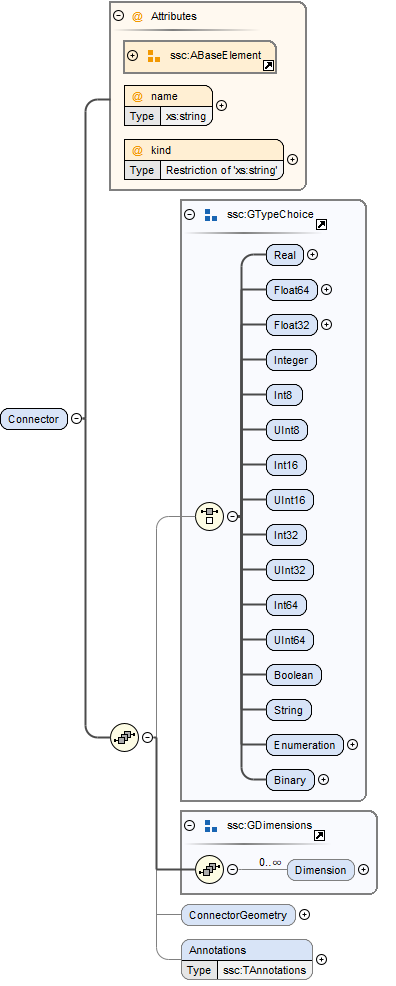

== System Structure Description (SSD)

A System Structure Description describes a nested hierarchy of interconnected (sub-)systems and atomic components.

A System Structure Description file (SSD, file extension .ssd) *MUST* be a well-formed XML 1.0 [XML10] file that conforms to the SystemStructureDescription XML Schema distributed as part of this standard.
The file *MUST* use the UTF-8 encoding.
All SSD-specific elements live in the http://ssp-standard.org/SSP1/SystemStructureDescription namespace, nicknamed ssd.

=== SystemStructureDescription

image:images/image23.png[image,width=464,height=506]

The root element of an SSD file *MUST* be a SystemStructureDescription element, which gives overall information about the system hierarchy described in this SSD file, including common meta-data, and acts as a bracket for the root system and its unit and enumeration definitions.

[width="100%",cols="28%,72%",options="header",]
|===
|Attribute |Description
|version |This required attribute specifies the version of this specification that the system description conforms to. Only major and minor version number are included, the patch version number *MUST NOT* be included in this attribute. For the current release this *MUST* be 1.0.
|name |This required attribute provides a name, which can be used for purposes of presenting the system structure to the user, for example when selecting individual variant SSDs from an SSP.
|===

The following XML child elements are specified for the SystemStructureDescription element:

[width="100%",cols="23%,77%",options="header",]
|===
|Element |Description
|System |This required element specifies the root system of the model, see section 5.3.
|Enumerations |This optional element *MUST* contain definitions for all enumerations referenced in the system description file. See section 4.4.1 for its definition.
|Units |This optional element *MUST* contain definitions for all units referenced in the system description file. See section 4.4.2 for its definition.
|DefaultExperiment |This optional element *MAY* contain information of a default simulation setup that is supplied with the system definition for informational purposes, see description below.
|===

The root system of the model is specified through the required System element, see section 5.3.

Any enumerations and units referenced in the system description file *MUST* be provided through the optional Enumerations and Units elements, as described in sections 4.4.1 and 4.4.2 respectively.

==== Default Experiment

image:images/image24.png[image,width=449,height=248]

This element contains information of a default simulation setup that is supplied with the system definition for informational purposes.

{empty}[ _Note that in contrast to FMI 2.0 only start and stop time are specified here, since values like step size or tolerance depend on the specific solver or master algorithms employed and are hence not specified in this global element.
Additional solver or master algorithm specific information can be supplied through the annotation mechanism, or using a future layered standard._ ]

{empty}[ _The handling of systems comprising components with differing units for the independent variable depends on the implementation.
It should be noted that since FMI 2.0 the unit of the independent variable for FMUs is clearly specified: It defaults to seconds, however other units can be specified by explicitly defining the independent variable.
This standard does not specify additional measures to deal with differing independent variable units, but leaves this to the implementation._ ]

[width="100%",cols="28%,72%",options="header",]
|===
|Attribute |Description
|startTime |This optional attribute gives the start time of the simulation.
|stopTime |This optional attribute gives the stop time of the simulation.
|===

=== Common Model Element Type

System, Component and SignalDictionaryReference XML elements are subtypes of a common TElement base type, that contains attributes and XML elements common to all kinds of model elements:

image:images/image25.png[image,width=379,height=280]

The following XML attributes are specified for the TElement type:

[width="100%",cols="28%,72%",options="header",]
|===
|Attribute |Description
|name |This required attribute gives the model element a name, which is used to identify the model element inside its parent system. The name *MUST* be unique within the directly enclosing parent system. The name *MUST NOT* be the empty string.
|===

The following XML child elements are specified for the TElement type:

[width="100%",cols="23%,77%",options="header",]
|===
|Element |Description
|Connectors |This optional element specifies the set of connectors of this model element, which represent the interface of the model element to the outside world. See below for details.
|ElementGeometry |This optional element defines the geometry information of the component. See below for details.
|ParameterBindings |This optional element specifies the set of parameter bindings of this model element. See below for details.
|===

==== Connectors

image:images/image26.png[image,width=371,height=82]

This optional element specifies the set of connectors of this model element, which represent the interface of the model element to the outside world.
For components the set of connectors *MUST* match variables/ports of the underlying component implementation, e.g., for referenced FMI 2.0 FMUs, the name of a connector has to match the name attribute of the corresponding <ScalarVariable> element; for referenced FMUs that follow the OSI Sensor Model Packaging specification [OSMP120], the name of a connector of type Binary has to match the name attribute of the corresponding <osmp:osmp-binary-variable>.
For FMI 3.0 FMUs, the connector name has to match either the name of the corresponding variable element, or one of its <Alias> elements.

Names of variable elements of an FMU might follow the “Variable Naming Conventions” specification as defined by the FMI standard.
Hence, several ScalarVariables might be grouped as a structure or an array.
However, the name of a connector *MUST* match the name of a single <ScalarVariable>.

Note that there is no requirement that connectors have to be present for all variables/ports of an underlying component implementation.
At least those connectors *MUST* be present which are referenced in connections inside the SSD. [ _Note that connectors do not have to be referenced in connections.
Unreferenced connectors will yield the behavior that is specified for the underlying component variables/ports, e.g. an unconnected FMU input variable will remain at its default value during the whole simulation.
The same is true for variables/ports that are not referenced through a connector at all._ ]

The following XML attributes are specified for the Connector element:

[width="100%",cols="28%,72%",options="header",]
|===
|Attribute |Description
|name a|
This attribute gives the connector a name, which *SHALL* be unique within the given model element, and, for components, *MUST* match the name of a relevant variable/port in the underlying component implementation. In the case of referenced FMUs this *MUST* match the name of the relevant variable or alias in the referenced FMU.

Note that there is no requirement that connectors have to be present for all variables/ports of an underlying component implementation. At least those connectors *MUST* be present which are referenced in connections inside the SSD.

|kind a|
This attribute specifies the kind of the given connector, which indicates whether the connector is an input, an output, both (inout), a local variable, a constant, a parameter, a calculated parameter (i.e. a parameter that is calculated by the component during initialization), or a structural parameter (i.e. a parameter that can be set during (re-)configuration mode).

For components this *MUST* match the related kind of the underlying component implementation.
For referenced FMUs it *MUST* match the combination of variability and causality:

For FMI 2.0 and 3.0 this means that the causality of the variable *MUST* match the kind of the connector (with the kind inout not being valid for either FMI 3.0, 2.0, or 1.0).

For FMI 1.0 this means that for connectors of kind input or output the causality of the variable *MUST* be input or output and the variability of the variable *MUST* be discrete or continuous (for outputs also constant and parameter are allowable).
For connectors of kind parameter the causality of the FMI 1.0 variable *MUST* be input or internal and the variability *MUST* be parameter.
For connectors of kind calculatedParameter the causality of the FMI 1.0 variable *MUST* be output and the variability *MUST* be parameter.
For connectors of kind constant the causality of the FMI 1.0 variable *MUST* be output and the variability *MUST* be constant.

Connectors of kind `local` are used to define variables of the model element.
Such a variable is not intended to be used for connections.
However, if it is connected, the semantics are same as for an `output`.

For SignalDictionaryReferences, the kind of a given connector can additionally be inout, which indicates that the semantics of the connector are derived from the connections going to the connector.
This can be used for example to allow a connector to function as both an input and output within the same SignalDictionaryReference.

|===

The following XML child elements are specified for the Connector element:

[width="100%",cols="23%,77%",options="header",]
|===
|Element |Description
|Real / Float64 / Float32 / +
Integer / Int8 / UInt8 / Int16 / UInt16 / +
Int32 / UInt32 / Int64 / UInt64 / +
Boolean / String / Enumeration / Binary |Exactly one of these elements *CAN* be present to specify the type of the Connector. See <<ssc_types>> for details.
|Dimension |One or more of these optional elements specify the connector array dimensions, making the connector an array connector. See <<ssc_dimensions>> for details.
|ConnectorGeometry |This optional element defines the geometry information of the connector. See below for details.
|===

The type of the Connector is identified by the presence of one of the XML child elements Real, Float64, Float32, Integer, Int8, UInt8, Int16, UInt16, Int32, UInt32, Int64, UInt64, Boolean, String, Enumeration, or Binary.

The dimensionality of the Connector is given by the presence of one or more Dimension elements.

===== ConnectorGeometry

image:images/image28.png[image,width=307,height=149]

This optional XML element gives the geometry information of the connector.
Note that x and y coordinates are in a special coordinate system, where 0,0 is the lower-left corner of the containing model element, and 1,1 is the upper-right corner of the model element, regardless of aspect ratio.

For systems the placement of connectors for the inside and outside view of the system is identical, the special coordinate system is just translated to different actual coordinate systems, namely the one determined by the ElementGeometry for the outside view, and the one determined by SystemGeometry for the inside view.

If defined, this ConnectorGeometry overrides any ConnectorGeometry of a System in a referenced SSD file or any port location defined by an .fmu file (as defined in the relevant FMI standards).

[width="100%",cols="28%,72%",options="header",]
|===
|Attribute |Description
|x |Required attribute giving the x coordinate of the connector inside the special coordinate system.
|y |Required attribute giving the y coordinate of the connector inside the special coordinate system.
|===

[ _Graphical example for a ConnectorGeometry:_
image:images/ConnectorGeometryExample.png[image]
]

==== ElementGeometry

image:images/image29.png[image,width=339,height=603]

This optional XML element defines the geometry information of the model element, where (x1,y1) and (x2,y2) define the positions of the lower-left and upper-right corners of the model element in the coordinate system of its parent system.
If x1>x2 this indicates horizontal flipping, y1>y2 indicates vertical flipping.

The optional attribute rotation (in degrees) defines an additional rotation (applied after flipping), where positive numbers indicate a counter clockwise rotation.

{empty}[_Sometimes such a counter clockwise orientation is also called a left rotation (x→y), with the coordinate system orientation: x → right, y → up)_]

The optional attribute iconSource defines an icon URI with the same semantics as for the source attribute of the Component element.
If defined, this icon overrides any icon that may be defined in an .fmu file (as defined in the relevant FMI standards).
It is *RECOMMENDED* that implementations that support graphical presentation support at least PNG and SVG file formats for the icon.

The optional attribute iconRotation defines the rotation (in degrees) of the icon.
The optional attribute iconFixedAspectRatio defines whether the icon shall be fit into the extent defined by (x1,y1), (x2,y2) and iconRotation with fixed aspect ratio.
The optional attribute iconFlip defines whether any flipping indicated by (x1,y1), (x2,y2) shall be applied to the icon graphics, too.

{empty}[_If no explicit icon is given, the icon used by the tool to represent the system should be rotated accordingly._]

[width="100%",cols="28%,72%",options="header",]
|===
|Attribute |Description
|x1 |Required attribute giving the x coordinate of the lower left corner of the model element inside the coordinate system of its parent system.
|y1 |Required attribute giving the y coordinate of the lower left corner of the model element inside the coordinate system of its parent system.
|x2 |Required attribute giving the x coordinate of the upper right corner of the model element inside the coordinate system of its parent system.
|y2 |Required attribute giving the y coordinate of the upper right corner of the model element inside the coordinate system of its parent system.
|rotation |Optional attribute defines an additional rotation in degrees that is to be applied after any flipping, where positive numbers indicate left rotation (x→y).
|iconSource |Optional attribute defines an icon URI with the same semantics as for the source attribute of the Component element. If defined, this icon overrides any icon that may be defined in an .fmu file (as specified in the relevant FMI standards). It is *RECOMMENDED* that implementations that support graphical presentation support at least PNG and SVG file formats for the icon.
|iconRotation |Optional attribute defines the rotation (in degrees) of the icon, where positive numbers indicate left rotation (x→y).
|iconFlip |Optional attribute defines whether any flipping indicated by (x1,y1), (x2,y2) shall be applied to the icon graphics, too, or not.
|iconFixedAspectRatio |Optional attribute defines whether the icon shall be fit into the extent defined by (x1,y1), (x2,y2) with a fixed aspect ratio, or without keeping the aspect ratio fixed.
|===

[ _Graphical example for an ElementGeometry:_
image:images/ElementGeometryExample.png[image]
]

[_The next examples show the effects of attributes of the ElementGeometry on the visual representation of a reference element:_

_*Non-transformed reference* (icon fills rectangle, left 2 inputs, right 1 output)_

image:images/IconExampleBase.png[image,width=245,height=86]

*_Coordinate systems:_*

_Red: ConnectorGeometry +
Blue: ElementGeometry_

__*Example 1: No flip* (__x1__<__x2__,__ y1__<__y2__),__ rotation__=**0** +
__iconRotation__=**0**,__ iconFixedAspectRatio__=**true**,__ iconFlip__=**IGNORED** (relevant only if element is flipped)__

image:images/IconExample1.png[image,width=367,height=215]

__*Example 2: No flip* (__x1__<__x2__,__ y1__<__y2__),__ rotation__=**0** +
__iconRotation__=**0**,__ iconFixedAspectRatio__=**false, **__iconFlip__=**IGNORED**__

image:images/IconExample2.png[image,width=245,height=143]

*_ +
_*

__*Example 3: No flip* (__x1__<__x2__,__ y1__<__y2__),__ rotation__=**ϕ** +
__iconRotation__=**ϕ**,__ iconFixedAspectRatio__=**true**,__ iconFlip__=**IGNORED**__

image:images/IconExample3.png[image,width=367,height=215]

__*Example 4: No flip* (__x1__<__x2__,__ y1__<__y2__),__ rotation__=**ϕ +
**__iconRotation__=**ϕ**,__ iconFixedAspectRatio__=**false**,__ iconFlip__=**IGNORED**__

image:images/IconExample4.png[image,width=249,height=147]

*_ +
_*

__*Example 5: No flip* (__x1__<__x2__,__ y1__<__y2__),__ rotation__=**ϕ** +
__iconRotation__=**0**,__ iconFixedAspectRatio__=**true**,__ iconFlip__=**IGNORED**__

image:images/IconExample5.png[image,width=367,height=215]

__*Example 6: No flip* (__x1__<__x2__,__ y1__<__y2__),__ rotation__=**ϕ** +
__iconRotation__=**0**,__ iconFixedAspectRatio__=**false**,__ iconFlip__=**IGNORED**__

image:images/IconExample6.png[image,width=249,height=147]

_ +
_

__*Example 7: Horizontal flip* (__x1__>__x2__),__ rotation__=**ϕ** +
__iconRotation__=**ϕ**,__ iconFixedAspectRatio__=**true**,__ iconFlip__=**true**__

image:images/IconExample7.png[image,width=367,height=215]

__*Example 8: Horizontal flip* (__x1__>__x2__),__ rotation__=**ϕ** +
__iconRotation__=**ϕ**,__ iconFixedAspectRatio__=**false**,__ iconFlip__=**false**__

image:images/IconExample8.png[image,width=241,height=143]

__*Example 9: Horizontal flip* (__x1__>__x2__),__ rotation__=**ϕ** +
__iconRotation__=**ϕ**,__ iconFixedAspectRatio__=**true**,__ iconFlip__=**false**__

image:images/IconExample9.png[image,width=245,height=147]

_ +
_

__*Example 10: Vertical flip* (__y1__>__y2__),__ rotation__=**0 +
**__iconRotation__=**0**,__ iconFixedAspectRatio__=**true**,__ iconFlip__=**false**__

image:images/IconExample10.png[image,width=367,height=215]

__*Example 11: Horizontal and vertical flip* (__x1__>__x2__,__ y1__>__y2__),__ rotation__=**0 +
**__iconRotation__=**0**,__ iconFixedAspectRatio__=**true**,__ iconFlip__=**false**__

image:images/IconExample11.png[image,width=367,height=215]

__*Example 12: Horizontal and vertical flip* (__x1__>__x2__,__ y1__>__y2__)*, *__rotation__=**0 +
**__iconRotation__=**0**,__ iconFixedAspectRatio__=**true,**__ iconFlip__=**true**__

image:images/IconExample12.png[image,width=249,height=147]

*_ +
_*

__*Example 13: Horizontal and vertical flip* (__x1__>__x2__,__ y1__>__y2__),__ rotation__=**ϕ +
**__iconRotation__=**ϕ**,__ iconFixedAspectRatio__=**true**,__ iconFlip__=**true**__

image:images/IconExample13.png[image,width=367,height=215]

__*Example 14: Horizontal and vertical flip* (__x1__>__x2__,__ y1__>__y2__),__ rotation__=**ϕ +
**__iconRotation__=**ϕ**,__ iconFixedAspectRatio__=**false, **__iconFlip__=**true**__

image:images/IconExample14.png[image,width=249,height=147]

__*Example 15: Horizontal and vertical flip* (__x1__>__x2__,__ y1__>__y2__),__ rotation__=**ϕ +
**__iconRotation__=**ϕ**,__ iconFixedAspectRatio__=**true, **__iconFlip__=**false**__

image:images/IconExample15.png[image,width=245,height=147]

]

==== ParameterBindings

image:images/image32.png[image,width=646,height=470]

The ParameterBindings element provides the parameter bindings for a component or system, where each binding is specified in a ParameterBinding element.
A parameter binding applies a set of parameter values (a parameter set), supplied by a parameter source (for example a parameter file) to parametrize a component or system.

For FMU components this allows the parametrization of the FMU's parameters, structural parameters, and start values of other variables.
For systems this allows the parametrization of complete (sub-)hierarchies of sub-systems and components using a hierarchical naming scheme.

When no parameter mapping is specified as part of the binding, then all the parameter values provided by the parameter source are applied using their original names.
If a parameter matching this name is found in the system, the parameter value is applied.
Otherwise that parameter value is ignored.

When a parameter mapping is specified as part of the binding, then only the mapped parameter values are applied, using their mapped-to names.
Non-mapped parameter values are not applied in this case.

For FMU components parameter values are applied to FMU variables based on the variables’ names in the FMU, i.e. it is *not required* (but allowed) that those variables are referenced in connectors in the system description.

For systems parameter values are applied using the hierarchical names of parameters or other variables in the system.

The hierarchical names of the parameters or other variables of a system are formed in the following way:

* Any variables of the system exposed through connectors of the system have the name of the connector as their name.
* For all elements of the system, the hierarchical names of the variables of those elements are formed by prepending the element name and a dot to the hierarchical names of the variables in that element.

{empty}[ _For example for a system A containing a system B which contains an exposed parameter named SP1 and an element C with a parameter P2, the hierarchical names of the parameters in system A are B.SP1 and B.C.P2 respectively.
The hierarchical name of those parameters inside system B are SP1 and C.P2 respectively._ ]

Note that the hierarchical names of parameters or other variables do not have to be unique: If two or more variables end up with the same hierarchical name (due to so-called punning), then any parameter values being applied to that name *MUST* be applied to all of them.
If this is not wanted, then it is up to the generating implementation to ensure that no punning occurs, through proper choice of system and element names.

{empty}[ _For example, for a system A containing a system B with component C and variable D, and system A also containing a component called B.C and variable D, both variables will have the hierarchical name A.B.C.D. If this is not wanted, then proper care should be taken in naming component B.C and system B/component C in non-conflicting ways.
The standard allows such punning, because the ability to have a . in the name of systems or components allows for example the replacement of a monolithic component with a system of components, or vice-versa, while keeping parameter names identical._ ]

More than one ParameterBinding can be supplied.
In this case all of the parameters found will be used to parametrize the component, with parameter values in ParameterBinding sources appearing at a succeeding position in the element order taking priority over prior sources at the same hierarchy level, should a parameter be included in more than one ParameterBinding source.

When ParameterBinding sources on multiple levels of the hierarchy supply values for the same parameter, bindings at a higher hierarchy level take precedence over lower levels, i.e. bindings at a system level take precedence over bindings at a sub-system or component level.

Parameter bindings for FMU components can be used to set any initial values in the FMU which are legal to change.
It is assumed that the parameterization is applied prior to initializing for FMI 1.0, or before entering initialization mode for FMI 2.0/3.0.
For structural parameters it is assumed that the parameterization is applied in configuration mode for FMI 3.0.

This means that variables eligible for parameterization are those with:

* either causality = "input" or a start value for FMI 1.0
* variability != "constant" and initial = "exact" or "approx" for FMI 2.0

All kinds of system connectors can be parameterized.
In case the system level connectors are connected to FMU components, the parameterization *MUST* be compatible with the variable in the connected FMU.

Parameter bindings that apply to a component that references another SSD/SSP are handled as if the top-level system of the SSD/SSP was present in the enclosing system instead of the component with one special case: Any parameter bindings in the component are treated as if they were present in the top-level system of the SSP/SSD after all parameter bindings of the system.
Therefore they take priority over any of the existing parameter bindings (for parameters with identical names).

[width="100%",cols="28%,72%",options="header",]
|===
|Attribute |Description
|type |Optional attribute giving the MIME type of the parameter source, which defaults to application/x-ssp-parameter-set to indicate the SSP parameter set file format. No further types are currently defined, but can of course be added at a later date, for pre-existing parameter file formats, like CDF, etc.
|source a|
Optional attribute indicating the source of the parameters as a URI (cf. RFC 3986). For purposes of the resolution of relative URIs the base URI is the URI of the SSD, if the sourceBase attribute is not specified or is specified as SSD, and the URI of the referenced component if the base attribute is specified as component.

This allows the specification of parameter sources that reside inside the component (for example an FMU) through relative URIs.

If the source attribute is missing, the parameter set *MUST* be provided inline as contents of a ParameterValues element, which *MUST NOT* be present otherwise.

|sourceBase |Defines the base the source URI is resolved against: If the attribute is missing or is specified as SSD, the source is resolved against the URI of the SSD, if the attribute is specified as component the URI is resolved against the (resolved) URI of the component source.
|prefix |Defines the optional prefix for name resolution and mapping purposes for this binding. If this attribute is empty or not supplied no prefix is used for name resolution and mapping, otherwise the specified prefix is prepended to all names in the parameter source prior to processing the normal name resolution or name mapping rules. This allows the user to apply a parameter set normally intended for a component (and thus containing bare parameter names) at a system level targeted to one element of the system by supplying the name of the element plus a dot as a prefix on the binding, thus causing all parameter names in the parameter set to be treated as if they were specified with proper hierarchical names.
|===

The following XML child elements are specified for the ParameterBinding element:

[width="100%",cols="23%,77%",options="header",]
|===
|Element |Description
|ParameterValues |This optional element can be used to provide parameter values inline to the parameter binding, in which case the source attribute of the ParameterBinding element *MUST* be empty.
|ParameterMapping |This optional element provides an optional parameter mapping, which specifies how the parameter names and values provided in the parameter source are to be mapped to the parameters of the component or system in question. If no mapping is supplied, the parameter names of the parameter source are used as is for name matching against the names of parameters in the component or system and the values of the parameter source are not transformed further before being applied. See below for details.
|===

===== ParameterValues

image:images/image33.png[image,width=369,height=65]

When this element is present, its contents *MUST* be an ssv:ParameterSet element as specified by the SystemStructureParameterValues schema, if the type attribute of the enclosing ParameterBinding element is application/x-ssp-parameter-set, or any other valid XML content if the type attribute references another MIME type.
In that case there *SHOULD* be a layered specification that defines how embedding the content works for that MIME type.

===== ParameterMapping

image:images/image34.png[image,width=441,height=355]

This element provides a parameter mapping, which specifies how the parameter names and values provided in the parameter source are to be mapped to the parameters of the component or system in question.
If no mapping is supplied, the parameter names of the parameter source are used as is for name matching against the names of parameters in the component or system and the values of the parameter source are not transformed further before being applied.

[width="100%",cols="28%,72%",options="header",]
|===
|Attribute |Description
|type |Optional attribute giving the MIME type of the parameter mapping, which defaults to application/x-ssp-parameter-mapping to indicate the SSP parameter mapping file format. No further types are currently defined, but can of course be added at a later date.
|source a|
Optional attribute indicating the source of the parameter mapping as a URI (cf. RFC 3986). For purposes of the resolution of relative URIs the base URI is the URI of the SSD, if the sourceBase attribute is not specified or is specified as SSD, and the URI of the referenced component if the base attribute is specified as component.

This allows the specification of parameter mapping sources that reside inside the component (for example an FMU) through relative URIs.

If the source attribute is missing, the parameter mapping *MUST* be provided inline as contents of the ParameterMapping element, which *MUST* be empty otherwise.

|sourceBase |Defines the base the source URI is resolved against: If the attribute is missing or is specified as SSD, the source is resolved against the URI of the SSD, if the attribute is specified as component the URI is resolved against the (resolved) URI of the component source.
|===

The contents of the element *MUST* be empty if the source attribute is present.
If the source attribute is not present, the contents *MUST* be an ssm:ParameterMapping element, if the type attribute of this element is application/x-ssp-parameter-mapping, or any other valid XML content if the type attribute references another MIME type.
In that case there *SHOULD* be a layered specification that defines how embedding the content works for that MIME type.

=== System

image:images/image35.png[image,width=452,height=641]

This element describes a system, which can contain components, signal dictionary references and other systems as elements, connectors as an interface to the outside world, and connections connecting the connectors of itself and of its elements to one another.

The following XML child elements are specified for the System element:

[width="100%",cols="28%,72%",options="header",]
|===
|Element |Description
|Elements |This optional element provides the elements contained in this system, see specification below.
|Connections |This optional element provides the connections between connectors of the system, connectors of its elements and inbetween those connectors.
|SignalDictionaries |This optional element provides the set of defined signal dictionaries for the system.
|SystemGeometry |This optional element defines the extent of the system canvas for the system.
|GraphicalElements |This optional element contains the set of purely graphical elements that are contained in the system, like notes, which have no semantic impact on the system but aid in presentation of the system in graphical user interfaces.
|===

==== Elements

image:images/image36.png[image,width=501,height=157]

This optional element contains one or more components, signal dictionary references or systems that are the internal content of the given system.

The following XML child elements are specified for the Elements element:

[width="100%",cols="33%,67%",options="header",]
|===
|Element |Description
|Component |A component, see section 4.6.
|SignalDictionaryReference |A reference to a signal dictionary, see section 4.7.
|System |A nested system, see section 4.5.
|===

==== Connections

image:images/image37.png[image,width=314,height=37]

This optional element provides the connections between connectors of the system, connectors of its elements and inbetween those connectors.

This element specifies a connection between two connectors, either of the system or its directly contained elements.
Note that only connections between certain kinds of connectors are allowed, as specified in section 5.3.2.1. Note also that the terms start and end in the attribute names of the connector, like startElement or endConnector, do not denote directionality of the data flow implied by the connector.
That is determined by the combination of the semantics of the actual connectors (variables/ports) connected and their kind attributes.

[width="100%",cols="30%,70%",options="header",]
|===
|Attribute |Description
|startElement |Optional attribute giving the the name of the element that contains the connector given as startConnector. If the attribute is not present, then the startConnector names a connector on this system.
|startConnector |Required attribute giving the name of the connector that is the start of the connection. If startElement is not supplied this indicates a connector on this system, otherwise the connector is to be found on the given element.
|startIndices |Optional attribute giving the list of indices of an array connector that this connection is restricted to. If not supplied this indicates that this connection applies to the whole connector, not just a single element.
|endElement |Optional attribute giving the name of the element that contains the connector given as endConnector. If the attribute is not present, then the endConnector names a connector on this system.
|endConnector |Required attribute giving the name of the connector that is the end of the connection. If endElement is not supplied this indicates a connector on this system, otherwise the connector is to be found on the given element.
|endIndices |Optional attribute giving the list of indices of an array connector that this connection is restricted to. If not supplied this indicates that this connection applies to the whole connector, not just a single element.
|suppressUnitConversion |Optional attribute specifying whether automatic conversions between start and end connector are performed using unit information potentially available for both start and end definitions. If this attribute is supplied and its value is true, then the environment will not perform any automatic unit conversions, otherwise automatic unit conversions can be performed. This is also relevant in conjunction with the optional linear transformation supplied via the LinearTransformation element: With suppressUnitConversion = true, the linear transformation is performed instead of any unit conversions, whereas otherwise the linear transformation is performed in addition to any unit conversions.
|===

===== Allowed connections

The following table specifies all allowed connections, depending on the owner of the connectors (connector of element or connector of the enclosing system) and the kind of the connectors being connected.
Note that source and destination in the following table indicate the resulting data flow and are unrelated to the start and end designation of a connection, as described above.

Implementations *MUST NOT* specify connections that are not of one of the allowed combinations in the following table.
Implementations *MUST* ensure that data flow is specified unambiguously, including ensuring that not multiple connections with inbound data flow enter into a connector signifying an input, inout, parameter, or structuralParameter connector of an element, or a local, constant, calculatedParameter, or output connector of an enclosing system.

It is implementation-defined whether connections between connectors of different types are allowed, and to what extent conversions are performed.
This includes type conversions that can be performed without data loss, e.g. converting from an output of type `Float32` to an input of type `Float64` or `Real`, as well as conversions that can potentially lead to data loss, e.g. converting from an output of type `Float64` to an input of type `Float32` or `Int8`.
It is also implementation-defined how and whether any error-handling at runtime is performed in those cases.

[width="100%",cols="22%,32%,21%,25%",options="header",]
|===
|Source | |Destination |
|*Owner* |*Kind* |*Owner* |*Kind*
|System |structuralParameter |System |calculatedParameter
|System |structuralParameter |System |output
|System |structuralParameter |System |local
|System |parameter |System |calculatedParameter
|System |parameter |System |output
|System |parameter |System |local
|System |input |System |output
|System |input |System |local
|System |structuralParameter |Element |structuralParameter
|System |structuralParameter |Element |parameter
|System |structuralParameter |Element |input
|System |structuralParameter |Element |inout
|System |parameter |Element |parameter
|System |parameter |Element |input
|System |parameter |Element |inout
|System |input |Element |input
|System |input |Element |inout
|Element |constant |Element |structuralParameter
|Element |constant |Element |parameter
|Element |constant |Element |input
|Element |constant |Element |inout
|Element |calculatedParameter |Element |parameter
|Element |calculatedParameter |Element |input
|Element |calculatedParameter |Element |inout
|Element |output |Element |input
|Element |output |Element |inout
|Element |local  |Element |input
|Element |local  |Element |inout
|Element |inout |Element |input
|Element |constant |System |constant
|Element |constant |System |calculatedParameter
|Element |constant |System |output
|Element |constant |System |local
|Element |calculatedParameter |System |calculatedParameter
|Element |calculatedParameter |System |output
|Element |calculatedParameter |System |local
|Element |output |System |output
|Element |output |System |local
|Element |local  |System |output
|Element |local  |System |local
|Element |inout |System |output
|Element |inout |System |local
|===

The following XML child elements are specified for the Connection element:

[width="100%",cols="42%,58%",options="header",]
|===
|Element |Description
|LinearTransformation / BooleanMappingTransformation / IntegerMappingTransformation / EnumerationMappingTransformation |Specifies an optional transformation for the connection. If any, exactly one of these elements *MUST* be present to specify the type of the transformation. See 4.5.2 Transformation Choice for details.
|ConnectionGeometry |This optional element defines the geometry information of the connection.
|===

===== ConnectionGeometry

image:images/image39.png[image,width=348,height=149]

This optional element defines the geometry information of the connection.
The start and end coordinates of the connection are derived automatically through the coordinates of the corresponding connectors.
The only relevant geometry information provided by the connection geometry is a, by default empty, list of intermediate waypoint coordinates, which are to be interpreted as for the svg:polyline primitive, i.e. as waypoints for straight line segments, with the first and last points added automatically based on the translated coordinates of the start and end connectors.
Note that x and y coordinates are in the coordinate system of the enclosing system.

[width="100%",cols="28%,72%",options="header",]
|===
|Attribute |Description
|pointsX |Required attribute giving a list of x coordinates of the intermediate waypoints.
|pointsY |Required attribute giving a list of y coordinates of the intermediate waypoints.
|===

[ _Graphical example for a ConnectionGeometry:_
image:images/ConnectionGeometryExample.png[image]
]

==== SignalDictionaries

Signal dictionaries can be seen as a description of a collection of signals.
Such collections can also be seen as a “signal bus” (like a CAN-bus in embedded systems).
One can use a signal dictionary as a specification of how a collection of signals shall look like with definition of signal names and their units during a design phase.
When a large number of signals have to be handled, signal dictionaries can help to keep a system description clearly represented.

Another benefit of signal dictionaries is the possibility to define a mapping between two or more signal dictionaries that may differ by names or units, which is a common case when components are integrated into a system that come from different sources without a common design or architecture.image:images/image40.png[image,width=427,height=82]

This optional element provides the set of defined signal dictionaries for the system.

image:images/image41.png[image,width=415,height=336]

A signal dictionary is a collection of signals which can be accessed in different systems at different levels of the hierarchy through signal dictionary references referencing the signal dictionary.

[width="100%",cols="26%,74%",options="header",]
|===
|Attribute |Description
|name |Required attribute giving the signal dictionary a name, which shall be unique within the directly enclosing system. The name is used for purposes of specifying the signal dictionary referenced by a signal dictionary reference. Name lookups occur in hierarchical fashion, i.e. the name is first looked up in the system that contains a signal dictionary reference. If that lookup yields no match, the lookup is performed on the enclosing system, etc., until a match is found. It is an error if no matching signal dictionary is found.
|type |Optional attribute giving the MIME type of the signal dictionary, which defaults to application/x-ssp-signal-dictionary to indicate the SSP signal dictionary file format. No further types are currently defined, but can of course be added at a later date.
|source a|
This attribute indicates the source of the signal dictionary as a URI (cf. RFC 3986). For purposes of the resolution of relative URIs the base URI is the URI of the SSD.

If the source attribute is missing, the signal dictionary *MUST* be provided inline as contents of the SignalDictionary element, which *MUST* be empty otherwise. For the default type application/x-ssp-signal-dictionary such inline content *MUST* be a SignalDictionary from the SystemStructureSignalDictionary namespace. See section 8 for details.

|===

==== SystemGeometry

image:images/image42.png[image,width=293,height=257]

This element defines the extent of the system canvas. (x1,y1) and (x2,y2) define the lower-left and upper-right corner, respectively.
Different from ElementGeometry, where x1 > x2 and y1 > y2 indicate flipping, x1 < x2 and y1 < y2 *MUST* hold here.

If undefined, the system canvas extent defaults to the bounding box of all ElementGeometry elements of the child elements of the system.

When displaying the content of a sub-system together with the enclosing parent system, the transformation of co-coordinates inside the sub-system to co-ordinates in the parent system is defined by the transformation from SystemGeometry.\{x1,y1,x2,y2} to ElementGeometry.\{x1',y1',x2',y2'}, where ElementGeometry.z' is the respective coordinate of the sub-system when instantiated in the parent system after rotation.

When importing or exporting systems, the nominal unit of the coordinates is 1 mm for all axis.
The nominal unit is intended to ensure similar visual sizing and appearances when combining systems from different implementations.

{empty}[ _The visual appearance of a length of 1 should be (roughly) 1 mm.
Importing and exporting tools that support a graphical representation might use different coordinate systems.
This common unit for coordinates is defined to allow a seamless integration of SSPs from different sources.
Without such a common unit, an SSP exported in one tool might appear huge or tiny in the other tool.
Hence, the exporting tool has to scale from its own coordinate system when exporting and the importing tool has to scale to its own coordinate system when importing an SSP._ ]

[width="100%",cols="28%,72%",options="header",]
|===
|Attribute |Description
|x1 |Required attribute giving the x coordinate of the lower-left corner of the system canvas.
|y1 |Required attribute giving the y coordinate of the lower-left corner of the system canvas.
|x2 |Required attribute giving the x coordinate of the upper-right corner of the system canvas.
|y2 |Required attribute giving the y coordinate of the upper-right corner of the system canvas.
|===

[ _Graphical example for a SystemGeometry:_
image:images/SystemGeometryExample.png[image]
]

[ _Graphical example showing the interplay of SystemGeometry, ElementGeometry, ConnectorGeometry, and ConnectionGeometry:_
image:images/GeometryInterplayExample.png[image]
]

[ _Example how the given Geometries can be used to transform coordinates to show elements on different hierarchy levels in a single graphic:_

_Subsystem A is an element with an ElementGeometry (x1_Ae, y1_Ae, x2_Ae, y2_Ae) and a SystemGeometry (x1_As, y1_As, x2_As, y2_As)._

_B is an element in subystem A with an ElementGeometry coordinates (x1_Be, y1_Be, x2_Be, y2_Be)._

image:images/GeometryInterplayCoordinates.png[image]

_To plot the element B in the system where A is located, use the following coordinate transformation:_

_x1_Be -> (x1_Ae + (x1_Be - x1_As) * (x2_Ae - x1_Ae) / (x2_As - x1_As))_

_y1_Be -> (y1_Ae + (y1_Be - y1_As) * (y2_Ae - y1_Ae) / (y2_As - y1_As))_

_x2_Be -> (x1_Ae + (x2_Be - x1_As) * (x2_Ae - x1_Ae) / (x2_As - x1_As))_

_y2_Be -> (y1_Ae + (y2_Be - y1_As) * (y2_Ae - y1_Ae) / (y2_As - y1_As))_

_]_

==== GraphicalElements

image:images/image43.png[image,width=382,height=37]

This optional element contains the set of purely graphical elements that are contained in the system, like notes, which have no semantic impact on the system but aid in presentation of the system in graphical user interfaces.

Currently the only graphical element defined is the Note element, which allows for simple textual notes to be placed into the system diagram, but in the future more elements might be added as needed for exchange of graphical information.

===== Note

image:images/image44.png[image,width=232,height=311]

This element defines a graphical note to be placed on the canvas of the enclosing system.
It is sized using the attributes so that the coordinates (x1,y1) and (x2,y2) define the positions of the lower-left and upper-right corners of the note in the coordinate system of the parent.

The note text is given by the text attribute.
The presentation expectation is that the text is automatically sized and wrapped in such a way that it fits the note area.
If this would lead to too small text, it might be necessary to provide an interactive method (like expanding triangle, or popup, or other means) to show the remainder of the note text.
Inside the text attribute, newlines indicate paragraph breaks.

[width="100%",cols="28%,72%",options="header",]
|===
|Attribute |Description
|x1 |Required attribute giving the x coordinate of the lower-left corner of the note.
|y1 |Required attribute giving the y coordinate of the lower-left corner of the note.
|x2 |Required attribute giving the x coordinate of the upper-right corner of the note.
|y2 |Required attribute giving the y coordinate of the upper-right corner of the note.
|===

=== Component

image:images/image45.png[image,width=470,height=588]

A component is an atomic element of a system (i.e. its internal structure is not specified).

[width="100%",cols="28%,72%",options="header",]
|===
|Attribute |Description
|type |Optional attribute giving the MIME type of the component, which defaults to application/x-fmu-sharedlibrary to indicate the type of the component. Valid further types are application/x-ssp-definition for system structure description files, and application/x-ssp-package for system structure package files. No further types are currently defined.
|source a|
This attribute indicates the source of the component as an URI (cf. RFC 3986). For purposes of the resolution of relative URIs the base URI is the URI of the SSD. Therefore for components that are located alongside the SSD, relative URIs without scheme and authority *CAN* and *SHOULD* be used to specify the component sources. For components that are packaged inside an SSP that contains this SSD, this is *REQUIRED* (in this way, the SSD URIs remain valid after unpacking the SSP into the filesystem).

{empty}[ _For example for an FMU called MyDemoFMU.fmu, that is located in the resources directory of an SSP, the correct URI would be resources/MyDemoFMU.fmu._ ]

When referencing another SSP, by default the default SSD of the SSP (i.e. SystemStructure.ssd) is referenced. When a non-default SSD should be selected, then the name of the non-default SSD *MUST* be given through a fragment identifier, i.e. the URI resources/SubSSP.ssp#VariantB.ssd would reference the VariantB.ssd of SubSSP.ssp located in the resources directory relative to this SSD.

When the URI is a same-document URI with a fragment identifier, for example #other-system, then the fragment identifier *MUST* identify a system element in this SSD document with an id attribute identical to the fragment identifier. This mechanism can be used to instantiate an embedded system definition multiple times through reference to its definition element.

Note that implementations are only *REQUIRED* to support relative URIs as specified above, and that especially relative URIs that move beyond the baseURI (i.e. go "up" a level via ..) are *not required* to be supported by implementations, and are in fact often not supported for security or other reasons. Implementations are also *not required* to support any absolute URIs and any specific URI schemes (but are of course allowed to support any and all kinds of URIs where this is considered useful).

{empty}[ Since the release of SSP 1.0, the need to support the exchange of system structure descriptions containing components with no specified implementation has been identified, to exchange system designs as templates, for example. Future releases of SSP will therefore likely make the source attribute optional, to support such use cases. Current practice for 1.x has been to either already treat this attribute as optional or to use the empty string value to indicate a missing implementation. Tools wanting to support these use cases should therefore be prepared to accept SSD files with missing or empty source attributes on components, and treat them like empty systems for the purposes of semantics. ]

|implementation |When the referenced component is an FMU that contains multiple implementations [ _for example Co-Simulation and Model Exchange_], this optional attribute can be used to determine which FMU implementation should be employed. If the attribute is missing or uses the default value any, the importing tool is free to choose what kind of FMU implementation to use. If the value is CoSimulation or ModelExchange the corresponding FMU implementation *MUST* be used. It is an error if the specified type of FMU implementation is not present in the FMU.
|===

=== SignalDictionaryReference

image:images/image46.png[image,width=544,height=442]

A signal dictionary reference is an element of a system that references a signal dictionary, i.e. it is the place-holder of the signal dictionary that allows access to the contents of the signal dictionary through its connectors, which *MUST* reference signal dictionary entries.

[width="100%",cols="28%,72%",options="header",]
|===
|Attribute |Description
|dictionary a|
This required attribute gives the name of the signal dictionary that is to be referenced. Name lookups occur in hierarchical fashion, i.e. the name is first looked up in the system that contains a signal dictionary reference. If that lookup yields no match, the lookup is performed on the enclosing system, etc., until a match is found.

It is an error if no matching signal dictionary is found.
|===
