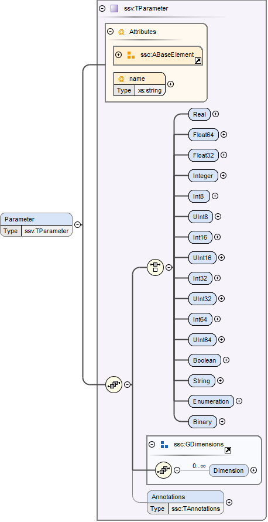
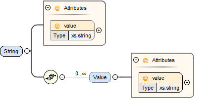
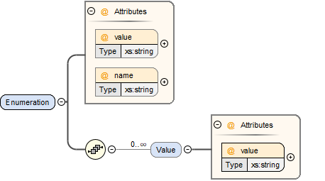
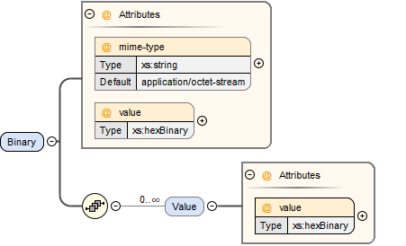

== System Structure Parameter Values (SSV)

A System Structure Parameter Values (abbreviated SSV) element provides parameter sets for a component or system.
The XML element can be inlined with its parent element or referenced from the parent element and supplied as a separate file that is either included within an SSP package or specified as an external URL.

For information on hierarchical naming structure and precedence rules, see section 5.2.3.

An SSV file *MUST* be a well-formed XML 1.0 [XML10] file that conforms to the SystemStructureParameterValues XML Schema that is distributed as part of this standard.
The file *MUST* use the UTF-8 encoding.
All SSV-specific elements live in the http://ssp-standard.org/SSP1/SystemStructureParameterValues namespace, nicknamed ssv.

It is *RECOMMENDED* that the file extension .ssv be used for stand-alone SSV files.
Except for this file extension recommendation the filename is arbitrary and is independent of variant handling or the names of SSD files.

=== ParameterSet

image:images/image47.png[image,width=394,height=453]

The ParameterSet element contains parameter and meta data information.
If the SSV is provided as a separate file, the root element *MUST* be a ParameterSet element.

[width="100%",cols="23%,77%",options="header",]
|===
|Attribute |Description
|version |This required attribute specifies the version of this specification that the parameter set conforms to. Only major and minor version number are included, the patch version number *MUST NOT* be included in this attribute. For the current release this *MUST* be 1.0.
|name |This required attribute provides a name which can be used for purposes of presenting the parameter set to the user.
|===

The following child elements are specified for the ParameterSet element:

[width="100%",cols="23%,77%",options="header",]
|===
|Element |Description
|Parameters |This required element specifies the parameters in the parameter set. See below for details.
|Enumerations |This optional element *MUST* contain definitions for all enumerations referenced in the parameter set. See section 4.4.1 for its definition.
|Units |This optional element *MUST* contain definitions for all units referenced in the parameter set. See section 4.4.2 for its definition.
|===

=== Parameters

image:images/image48.png[image,width=428,height=94]

The Parameters element contains a list of individual parameters.
If the list is empty, the parameter set *SHALL* not have any effect on any system or component it is applied to.

It is *not required* that all parameters included in the Parameters element correspond to parameters available in the components or systems the parameter set is applied to (through ParameterBinding elements in the system structure description).
This allows the definition of large parameter data sets out of which only a subset is applied in a given case.
See section 5.2.3 for the semantic defintion of parameter bindings.

The following XML attributes are specified for the Parameter element:

[width="100%",cols="23%,77%",options="header",]
|===
|Attribute |Description
|name |This required attribute specifies the name of the parameter in the parameter set. The name *MUST* be unique within the parameter set.
|===

The following XML child elements are specified for the Parameter element:

[width="100%",cols="31%,69%",options="header",]
|===
|Element |Description
|Real / Float64 / Float32 / +
Integer / Int8 / UInt8 / Int16 / UInt16 / +
Int32 / UInt32 / Int64 / UInt64 / +
Boolean / String / Enumeration / Binary |Exactly one of these elements *MUST* be present to specify the type of the parameter. See below for details on each type.
|===

==== Real

image:images/image50.png[image,width=231,height=149]

This type specifies a parameter that represents an IEEE754 double precision floating point number.

[width="100%",cols="23%,77%",options="header",]
|===
|Attribute |Description
|value |This required attribute specifies the value of the parameter.
|unit |This optional attribute gives the name of the unit of the parameter. The name *MUST* match the name of a unit defined in the Units element in the ParameterSet root element.
|===

==== Float64

image:images/image50.png[image,width=231,height=149]

This type specifies a parameter that represents an IEEE754 double precision floating point number.

[width="100%",cols="23%,77%",options="header",]
|===
|Attribute |Description
|value |This required attribute specifies the value of the parameter.
|unit |This optional attribute gives the name of the unit of the parameter. The name *MUST* match the name of a unit defined in the Units element in the ParameterSet root element.
|===

==== Float32

image:images/image50.png[image,width=231,height=149]

This type specifies a parameter that represents an IEEE754 single precision floating point number.

[width="100%",cols="23%,77%",options="header",]
|===
|Attribute |Description
|value |This required attribute specifies the value of the parameter.
|unit |This optional attribute gives the name of the unit of the parameter. The name *MUST* match the name of a unit defined in the Units element in the ParameterSet root element.
|===

==== Integer

image:images/image51.png[image,width=222,height=95]

This type specifies a parameter that represents a 32-bit signed integer.

[width="100%",cols="23%,77%",options="header",]
|===
|Attribute |Description
|value |This required attribute specifies the value of the parameter.
|===

==== Int8

image:images/image51.png[image,width=222,height=95]

This type specifies a parameter that represents a 8-bit signed integer.

[width="100%",cols="23%,77%",options="header",]
|===
|Attribute |Description
|value |This required attribute specifies the value of the parameter.
|===

==== UInt8

image:images/image51.png[image,width=222,height=95]

This type specifies a parameter that represents a 8-bit unsigned integer.

[width="100%",cols="23%,77%",options="header",]
|===
|Attribute |Description
|value |This required attribute specifies the value of the parameter.
|===

==== Int16

image:images/image51.png[image,width=222,height=95]

This type specifies a parameter that represents a 16-bit signed integer.

[width="100%",cols="23%,77%",options="header",]
|===
|Attribute |Description
|value |This required attribute specifies the value of the parameter.
|===

==== UInt16

image:images/image51.png[image,width=222,height=95]

This type specifies a parameter that represents a 16-bit unsigned integer.

[width="100%",cols="23%,77%",options="header",]
|===
|Attribute |Description
|value |This required attribute specifies the value of the parameter.
|===

==== Int32

image:images/image51.png[image,width=222,height=95]

This type specifies a parameter that represents a 32-bit signed integer.

[width="100%",cols="23%,77%",options="header",]
|===
|Attribute |Description
|value |This required attribute specifies the value of the parameter.
|===

==== UInt32

image:images/image51.png[image,width=222,height=95]

This type specifies a parameter that represents a 32-bit unsigned integer.

[width="100%",cols="23%,77%",options="header",]
|===
|Attribute |Description
|value |This required attribute specifies the value of the parameter.
|===

==== Int64

image:images/image51.png[image,width=222,height=95]

This type specifies a parameter that represents a 64-bit signed integer.

[width="100%",cols="23%,77%",options="header",]
|===
|Attribute |Description
|value |This required attribute specifies the value of the parameter.
|===

==== UInt64

image:images/image51.png[image,width=222,height=95]

This type specifies a parameter that represents a 64-bit unsigned integer.

[width="100%",cols="23%,77%",options="header",]
|===
|Attribute |Description
|value |This required attribute specifies the value of the parameter.
|===

==== Boolean

image:images/image52.png[image,width=255,height=95]

This type specifies a parameter that represents a Boolean value.

[width="100%",cols="23%,77%",options="header",]
|===
|Attribute |Description
|value |This required attribute specifies the value of the parameter.
|===

==== String

This type specifies a parameter that represents a zero-terminated UTF-8 encoded string.

[width="100%",cols="23%,77%",options="header",]
|===
|Attribute |Description
|value |This required attribute specifies the value of the parameter.
|===

==== Enumeration

This type specifies a parameter that represents an enumeration value, as specified by an enumeration definition.

[width="100%",cols="23%,77%",options="header",]
|===
|Attribute |Description
|value |This required attribute specifies the value of the parameter as the enumeration item name. Note that the actual numeric value this value is mapped to at run time will depend on the item mapping of the enumeration type of the variables being parameterized.
|name a|
This optional attribute specifies the name of the enumeration type that the parameter references. If it is supplied, the name *MUST* match the name of an enumeration type defined in the Enumerations element in the ParameterSet root element.

This attribute is optional; if it is not specified, then the list of valid enumeration items with their names and values is not specified, and the interpretation of the enumeration value is left solely to the variables that are being parameterized.

If the attribute is specified, implementations *MAY* use that information for user interface purposes, and/or for additional consistency checking.

{empty}[ _Note: the level of consistency checking is left optional by design, since mandating consistency checking across files requires unified types across files coming potentially from different sources, which is not always realistically possible._ ]

|===

==== Binary

This type specifies a parameter that represents a length-terminated binary data type.

[width="100%",cols="23%,77%",options="header",]
|===
|Attribute |Description
|value |This attribute gives the value of the parameter as a hex-encoded binary value.
|mime-type |This optional attribute specifies the MIME type of the underlying binary data, which defaults to the non-specific application/octet-stream type. This information can be used by the implementation to detect mismatches between binary parameters, or to provide automatic conversions between different formats. It should be noted that the implementation is *not required* to provide this service, i.e. it remains the responsibility of the operator to ensure only compatible binary connectors/parameters are connected.
|===
