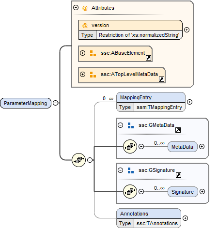

== System Structure Parameter Mapping (SSM) [[SSM]]

A parameter mapping describes a mapping between the parameters in a parameter source and the actual parameters of a system or component to which the parameters are to be applied.
The mapping maps the names of parameters in the source to the names of the parameters in the system or component that are to be parametrized.
It can also optionally provide for transformations that are to be applied on the value of the parameters prior to them being applied.

A parameter mapping can be provided either as a stand-alone XML file (an SSM file), which can be referenced from SSD files, or it can be embedded in an ssd:ParameterMapping element of the SSD directly (see <<ParameterMapping>>).

An SSM file *MUST* be a well-formed XML 1.0 [XML10] file that conforms to the SystemStructureParameterMapping XML Schema that is distributed as part of this standard.
The file *MUST* use the UTF-8 encoding.
All SSM-specific elements live in the `http://ssp-standard.org/SSP1/SystemStructureParameterMapping` namespace, nicknamed `ssm`.

It is *RECOMMENDED* that the file extension `.ssm` be used for stand-alone SSM files.
Except for this file extension recommendation the filename is arbitrary and is independent of variant handling or the names of SSD files.

The root element of an SSM file *MUST* be a ParameterMapping element, which contains an arbitrary number of MappingEntry elements.

=== ParameterMapping

This element describes a parameter mapping, which consists of multiple mapping entries, each describing one parameter mapping (see next section).
The parameter mapping *MUST* contain entries for all parameters that are going to be mapped.
All parameters of the parameter source which are not referenced in a mapping entry will not be applied.
All parameters that are referenced in a mapping entry will only be applied using the name they are mapped to, i.e. any original name is disregarded for applying parameters.
Implementations *MUST NOT* map multiple parameters to the same name.
Implementations *CAN* map the same parameter to multiple names.

[width="100%",cols="23%,77%",options="header",]
|===
|Attribute |Description
|version |This required attribute specifies the version of this specification that the parameter mapping conforms to.
Only major and minor version number are included, the patch version number *MUST NOT* be included in this attribute.
For the current release this *MUST* be either 1.0 or 2.0-rc.2.
If it is 1.0 the file *MUST* also conform fully to the 1.0 standard.
|===

==== MappingEntry

image:images/image57.png[image,width=577,height=556]

This element specifies a single mapping between a parameter in the source and a parameter of the system or component being parametrized.
Through its optional GTransformationChoice element a transformation can be specified that is to be applied to the parameter value prior to its application to its target parameter.

[width="100%",cols="30%,70%",options="header",]
|===
|Attribute |Description
|source |This required attribute specifies the name of the parameter in the parameter source that is to be mapped to a new name and/or provided with a transformation in this mapping entry.
|target |This required attribute specifies the name of the parameter in the system or component that is to be parametrized, i.e. that is the target of this mapping entry.
|suppressUnitConversion |This optional attribute specifies whether automatic conversions between parameter source and its target are performed using unit information potentially available for both value and target definitions.
If this attribute is supplied and its value is true, then the environment will not perform any automatic unit conversions, otherwise automatic unit conversions can be performed.

This is also important in conjunction with the optional linear transformation supplied via the LinearTransformation element: With suppressUnitConversion = true, the linear transformation is performed instead of any unit conversions, whereas otherwise the linear transformation is performed in addition to any unit conversions.
In that case the specified transformation will be done after any unit conversions have been performed on the value.
|===

The following XML child elements are specified for the MappingEntry element:

[width="100%",cols="42%,58%",options="header",]
|===
|Element |Description
|LinearTransformation / BooleanMappingTransformation / IntegerMappingTransformation / EnumerationMappingTransformation |Specifies an optional transformation for the mapping.
If any, exactly one of these elements *MUST* be present to specify the type of the transformation.
See <<Transformation Choice>> for details.
|===
