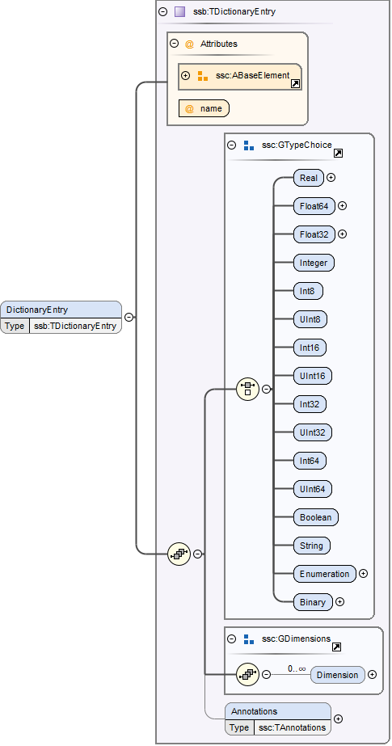

== System Structure Signal Dictionaries (SSB)

A signal dictionary is a collection of signals defined through its DictionaryEntry elements.

A signal dictionary can be provided either as a stand-alone XML file (an SSB file), which can be referenced from SSD files, or it can be embedded in an ssd:SignalDictionary element of the SSD directly (see section 5.3.3).

An SSB file *MUST* be a well-formed XML 1.0 [XML10] file that conforms to the SystemStructureSignalDictionary XML Schema that is distributed as part of this standard.
The file *MUST* use the UTF-8 encoding.
All SSB-specific elements live in the http://ssp-standard.org/SSP1/SystemStructureSignalDictionary namespace, nicknamed ssb.

It is *RECOMMENDED* that the file extension .ssb be used for stand-alone SSB files.
Except for this file extension recommendation the filename is arbitrary and is independent of variant handling or the names of SSD files.

The root element of an SSB file *MUST* be a SignalDictionary element, which contains an arbitrary number of DictionaryEntry elements.
Any enumerations or units used in the DictionaryEntry elements *MUST* be declared within the Enumerations and Units child elements of the SignalDictionary.

=== SignalDictionary

image:images/image58.png[image,width=408,height=399]

This element describes a signal dictionary, which consists of one or more dictionary entries, each describing one signal in the signal dictionary (see next section).

[width="100%",cols="23%,77%",options="header",]
|===
|Attribute |Description
|version |This required attribute specifies the version of this specification that the parameter mapping conforms to. Only major and minor version number are included, the patch version number *MUST NOT* be included in this attribute. For the current release this *MUST* be 1.0.
|===

The following XML child elements are specified for the SignalDictionary element:

[width="100%",cols="34%,66%,",options="header",]
|===
|Element |Description |
|DictionaryEntry |One or more entries of the signal dictionary. |
|Enumerations |This optional element *MUST* contain definitions for all enumerations referenced in the signal dictionary. |
|Units |This optional element *MUST* contain definitions for all units referenced in the signal dictionary. |
|===

==== DictionaryEntry

A dictionary entry defines a single signal in the signal dictionary.

[width="100%",cols="28%,72%",options="header",]
|===
|Attribute |Description
|name |Required attribute giving the signal dictionary entry a name, which shall be unique within the signal dictionary.
|===

The following XML child elements are specified for the DictionaryEntry element:

[width="100%",cols="33%,67%",options="header",]
|===
|Element |Description
|Real / Float64 / Float32 / +
Integer / Int8 / UInt8 / Int16 / UInt16 / +
Int32 / UInt32 / Int64 / UInt64 / +
Boolean / String / Enumeration / Binary |Exactly one of these elements *MUST* be present to specify the type of the signal dictionary entry. See section 4.5.1 for details.
|===
