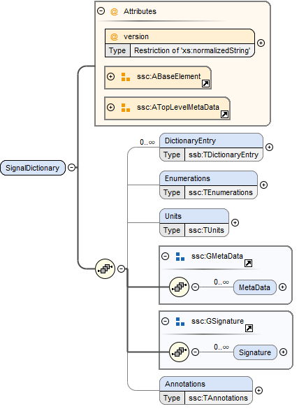

== System Structure Signal Dictionaries (SSB) [[SSB]]

A signal dictionary is a collection of signals defined through its DictionaryEntry elements.

A signal dictionary can be provided either as a stand-alone XML file (an SSB file), which can be referenced from SSD files, or it can be embedded in an ssd:SignalDictionary element of the SSD directly (see <<SignalDictionaries>>).

An SSB file must be a well-formed XML 1.0 <<XML10>> file that conforms to the SystemStructureSignalDictionary XML Schema that is distributed as part of this standard.
The file must use the UTF-8 encoding.
All SSB-specific elements live in the `http://ssp-standard.org/SSP1/SystemStructureSignalDictionary` namespace, nicknamed `ssb`.

It is recommended that the file extension `.ssb` be used for stand-alone SSB files.
Except for this file extension recommendation the filename is arbitrary and is independent of variant handling or the names of SSD files.

The root element of an SSB file must be a SignalDictionary element, which contains an arbitrary number of DictionaryEntry elements.
Any enumerations or units used in the DictionaryEntry elements must be declared within the Enumerations and Units child elements of the SignalDictionary.

=== SignalDictionary

This element describes a signal dictionary, which consists of one or more dictionary entries, each describing one signal in the signal dictionary (see next section).

[cols="1,4"]
|===
|Attribute |Description

|version
|This required attribute specifies the version of this specification that the parameter mapping conforms to.
Only major and minor version number are included, the patch version number must not be included in this attribute.
For the current release this must be either 1.0 or 2.0.
If it is 1.0 the file must also conform fully to the 1.0 standard.
|===

The following XML child elements are specified for the SignalDictionary element:

[cols="1,4"]
|===
|Element |Description

|DictionaryEntry
|One or more entries of the signal dictionary.

|Enumerations
|This optional element must contain definitions for all enumerations referenced in the signal dictionary.

|Units
|This optional element must contain definitions for all units referenced in the signal dictionary.
|===

==== DictionaryEntry

image:images/image59.png[]

A dictionary entry defines a single signal in the signal dictionary.

[cols="1,4"]
|===
|Attribute |Description

|name
|Required attribute giving the signal dictionary entry a name, which shall be unique within the signal dictionary.
|===

The following XML child elements are specified for the DictionaryEntry element:

[cols="1,4"]
|===
|Element |Description

|Real / Float64 / Float32 / Integer / Int8 / UInt8 / Int16 / UInt16 / Int32 / UInt32 / Int64 / UInt64 / Boolean / String / Enumeration / Binary |Exactly one of these elements must be present to specify the type of the signal dictionary entry.
See <<ssc_types>> for details.

|Dimension
|One or more of these optional elements define the signal dictionary entry array dimensions, making the signal dictionary entry an array signal dictionary entry.
See <<ssc_dimensions>> for details.
|===
